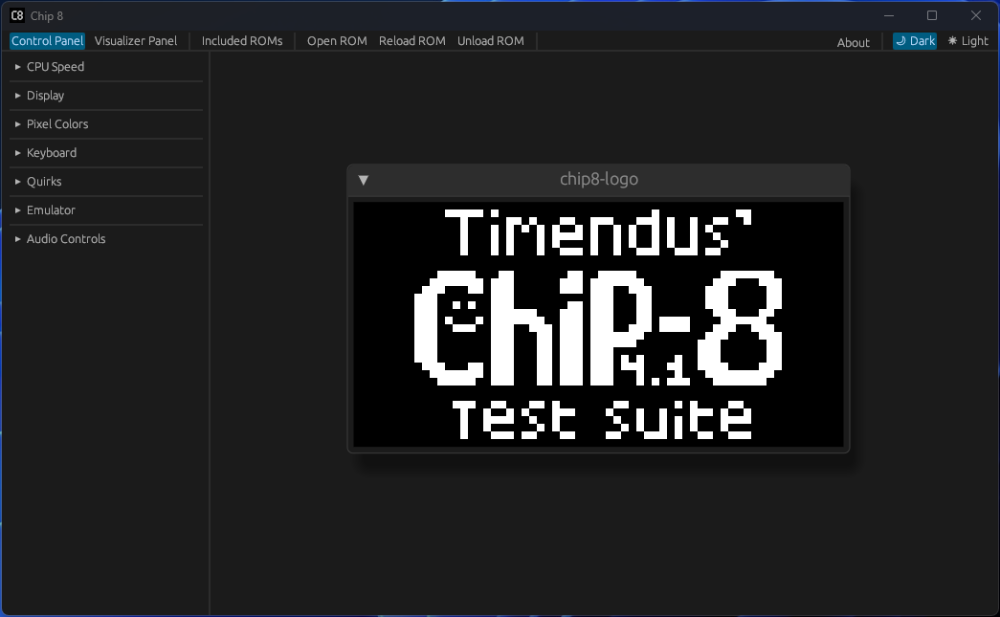

# Chip 8

[Live version here](https://iliags.github.io/chip8/)



## Emulator Info

Chip-8, Super Chip-8, and XO Chip-8 are mostly supported; audio features are lagging behind (it beeps, no buffers). It passes most of the tests available in [Timendus' test suite](https://github.com/Timendus/chip8-test-suite), with the failing tests being quirks which might be implemented at a later date.

### Input Mapping

``` None
    Keyboard                     CHIP-8
┌───┬───┬───┬───┐           ┌───┬───┬───┬───┐
│ 1 │ 2 │ 3 │ 4 │           │ 1 │ 2 │ 3 │ C │
├───┼───┼───┼───┤           ├───┼───┼───┼───┤
│ Q │ W │ E │ R │           │ 4 │ 5 │ 6 │ D │
├───┼───┼───┼───┤     →     ├───┼───┼───┼───┤
│ A │ S │ D │ F │           │ 7 │ 8 │ 9 │ E │
├───┼───┼───┼───┤           ├───┼───┼───┼───┤
│ Z │ X │ C │ V │           │ A │ 0 │ B │ F │
└───┴───┴───┴───┘           └───┴───┴───┴───┘
```

### Included ROMs

Some ROMs have been included for users to get familiar with the emulator.

- [Chip8 Test Suite by Timendus](https://github.com/Timendus/chip8-test-suite)
  - Extremely useful for testing functionality during development
- [Sample from Octo](https://github.com/JohnEarnest/Octo)
  - The simple example the emulator starts with
- [Chip 8 Archive](https://johnearnest.github.io/chip8Archive/)
  - An Evening to Die For (XO Chip 8)
  - Cave Explorer (Chip 8)
  - Flight Runner (Chip 8)
  - [Glitch Ghost](https://github.com/jackiekircher/glitch-ghost) (Chip 8)
  - Octoma (XO Chip 8)
  - Octo Rancher (Chip 8)
  - Rockto (Super Chip 8)
  - Skyward (XO Chip 8)

### Localization

The user-facing text uses [fluent-rs](https://github.com/projectfluent/fluent-rs). Currently, only `en-US` is available but the capability to add more is there.

## Building

### Desktop

- Install [rust](https://www.rust-lang.org/tools/install)
- Open a terminal in the repository location
  - Most operating systems have an option to open a terminal in the current folder when right clicking in the file browser.
- Enter ```cargo build --release``` to build but not execute, ```cargo run --release``` to build and execute
  - The ```--release``` flag can be removed to build the debug version

#### Linux

`libasound2-dev` is required for the `cpal` crate on linux, it can be installed with `sudo apt-get install -y libasound2-dev`.

In some cases, linux may also require `sudo apt-get install -y libclang-dev libgtk-3-dev libxcb-render0-dev libxcb-shape0-dev libxcb-xfixes0-dev libxkbcommon-dev libssl-dev`

### WASM

- Install [rust](https://www.rust-lang.org/tools/install)
- Install trunk using ```cargo install trunk```
  - This may take a while
- Open a terminal in the repository location:
  - Build ```trunk build --release```
  - Build and start a local web server ```trunk serve --release```

### Documentation

```cargo doc --workspace --no-deps```

## Testing

### Unit/Integration Tests

```cargo test --workspace```

### Benchmarks

Benchmarks are used for testing specific code during development and are not consistently implemented. They can be executed with ```cargo bench```.

### MIRI

See [miri repository](https://github.com/rust-lang/miri).

- Install the nightly toolchain with ```rustup toolchain install nightly```
- Install miri component on rust nightly: ```rustup +nightly component add miri```
- Run tests with miri: ```cargo +nightly miri test --workspace```
- Run application with miri: ```cargo +nightly miri run```
  - This takes a long time to run and currently fails due to an unsupported operation in `winit`.
