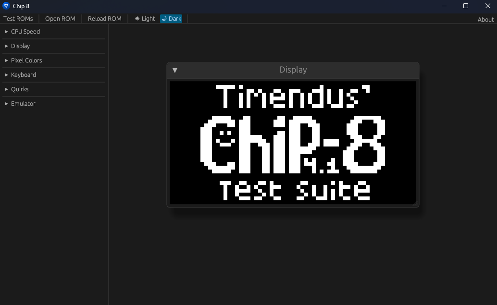

# Chip 8

A Chip-8 emulator for practice.

[Live version here](https://iliags.github.io/chip8/)



## Emulator Info

### Input Mapping

1234

QWER

ASDF

ZXCV

### Included ROMs

- [Chip8 Test Suite by Timendus](https://github.com/Timendus/chip8-test-suite)
- [Glitch Ghost](https://github.com/jackiekircher/glitch-ghost)
- [Samples from Octo](https://github.com/JohnEarnest/Octo)

### Localization

The user-facing text uses [fluent-rs](https://github.com/projectfluent/fluent-rs). Currently, only `en-US` is available but the capability to add more is there.

## Building

### PC

```cargo build --release```
```cargo run --release```

#### Linux

`libasound2-dev` is required for the `cpal` crate, it can be installed with `sudo apt-get install -y libasound2-dev`.

### WASM

- Install trunk using ```cargo install trunk```
  - This may take a while
- Build using ```trunk serve --release```

### Documentation

```cargo doc --workspace --no-deps```

### Build Warnings

If ```wasm-bindgen-cli``` was installed separately, but not updated, it may print a tool mismatch warning.

## Testing

### Unit/Integration Tests

```cargo test --workspace```

### MIRI

See [miri repository](https://github.com/rust-lang/miri).

- Install miri component on rust nightly: ```rustup +nightly component add miri```
- Run tests with miri: ```cargo +nightly miri test --workspace```
- Run application with miri: ```cargo +nightly miri run```
  - This takes a long time to run and currently fails due to an unsupported operation in `winit`.

## Wishlist

Stuff that might be added later.

- Disassembler
- Debugger
- System visualizer
- Save states
- Bind actions to keys instead of hardcoding input
- Chip-8 extensions
  - Super-Chip
  - XO-Chip
- Octo `options.json` compatibility
