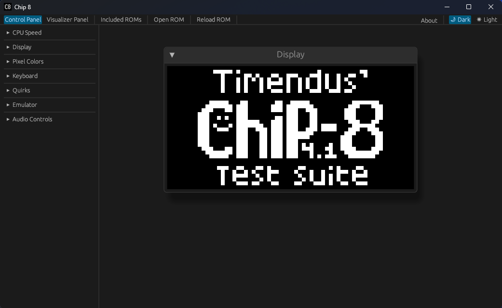

# Chip 8

[Live version here](https://iliags.github.io/chip8/)



## Emulator Info

Chip-8 and Super Chip 8 are mostly supported, XO-Chip is still work-in-progress. It passes most of the tests available in [Timendus' test suite](https://github.com/Timendus/chip8-test-suite), with the failing tests being non-issue quirks which might be implemented at a later date.

### Input Mapping

1234

QWER

ASDF

ZXCV

### Included ROMs

Some ROMs have been included for users to get familiar with the emulator.

- [Chip8 Test Suite by Timendus](https://github.com/Timendus/chip8-test-suite)
  - Extremely useful for testing functionality during development
- [Sample from Octo](https://github.com/JohnEarnest/Octo)
  - The Simple example the emulator starts with
- [Chip 8 Archive](https://johnearnest.github.io/chip8Archive/)
  - Cave Explorer (Chip 8)
  - Flight Runner (Chip 8)
  - [Glitch Ghost](https://github.com/jackiekircher/glitch-ghost) (Chip 8)
  - Octo Rancher (Chip 8)
  - Rockto (Super Chip 8)

### Localization

The user-facing text uses [fluent-rs](https://github.com/projectfluent/fluent-rs). Currently, only `en-US` is available but the capability to add more is there.

## Building

### PC

```cargo build --release```
```cargo run --release```

#### Linux

`libasound2-dev` is required for the `cpal` crate on linux, it can be installed with `sudo apt-get install -y libasound2-dev`.

In some cases, linux may also require `sudo apt-get install -y libclang-dev libgtk-3-dev libxcb-render0-dev libxcb-shape0-dev libxcb-xfixes0-dev libxkbcommon-dev libssl-dev`

### WASM

- Install trunk using ```cargo install trunk```
  - This may take a while
- Build using ```trunk serve --release```

### Documentation

```cargo doc --workspace --no-deps```

### Build Warnings

If ```wasm-bindgen-cli``` was installed separately, but not updated, it may print a tool mismatch warning.

## Testing

### Unit/Integration Tests

```cargo test --workspace```

### MIRI

See [miri repository](https://github.com/rust-lang/miri).

- Install miri component on rust nightly: ```rustup +nightly component add miri```
- Run tests with miri: ```cargo +nightly miri test --workspace```
- Run application with miri: ```cargo +nightly miri run```
  - This takes a long time to run and currently fails due to an unsupported operation in `winit`.

## Wishlist

Stuff that might be added later.

- Assembler/Disassembler
- Debugger
- System visualizer
- Save states
- Bind actions to keys instead of hardcoding input
- XO-Chip extension
- Octo `options.json` compatibility
- Runtime error messages rather than panicking.
